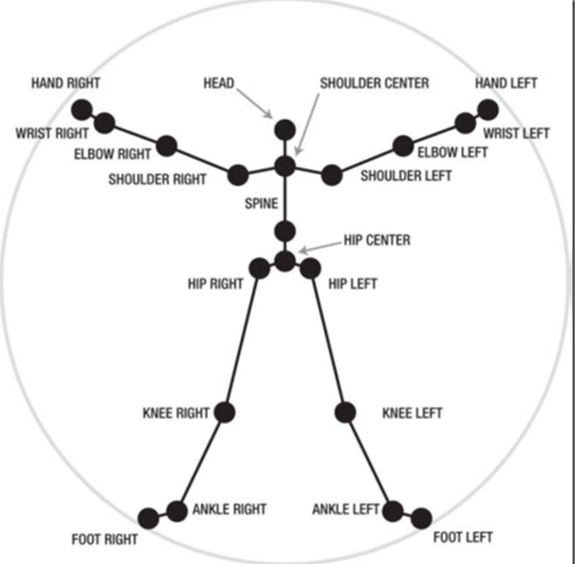

# Kinect_App

[TOC]

##  配置

**Win64 Debug**

**Kinect V2 SDK**

**vs项目属性：Kinect_App.props** *注：有路径要求，可以编辑这个文件，更改成自己的路径*

**opencv3.2**

**Qt5.92** 


## 代码文件组成

**main.cpp**  运行Kinect_App

**ui_Kinect_App.h ** 运行程序后根据ui文件自动生成的头文件

**Kinect_App.h** 定义了一个窗口类，包含一个ui_Kinect_App.h里的ui，进行界面的初始化和各种函数的声明

**Kinect_App.cpp**上述头文件的的实现文件


## 关节点对应枚举变量

```c++
JointType_SpineBase = 0,
JointType_SpineMid = 1,
JointType_Neck = 2,
JointType_Head = 3,
JointType_ShoulderLeft = 4,
JointType_ElbowLeft = 5,
JointType_WristLeft = 6,
JointType_HandLeft = 7,
JointType_ShoulderRight = 8,
JointType_ElbowRight = 9,
JointType_WristRight = 10,
JointType_HandRight = 11,
JointType_HipLeft = 12,
JointType_KneeLeft = 13,
JointType_AnkleLeft = 14,
JointType_FootLeft = 15,
JointType_HipRight = 16,
JointType_KneeRight = 17,
JointType_AnkleRight = 18,
JointType_FootRight = 19,
JointType_SpineShoulder = 20,
JointType_HandTipLeft = 21,
JointType_ThumbLeft = 22,
JointType_HandTipRight = 23,
JointType_ThumbRight = 24,
JointType_Count = (JointType_ThumbRight + 1)
```





## 捕捉状态对应枚举变量

```c++
TrackingState_NotTracked = 0,
TrackingState_Inferred = 1,
TrackingState_Tracked = 2
```


## 视频流处理

​	connect把timer和getFrame连在一起，timeout()为信号，得到信号就调用getFrame	

​	通过timer的start，开始计时，每50ms调用之前通过connect连接的getframe函数，从kinectsensor中获取图片，处理后转换格式显示到label_2中。其中时间间隔可在start(50)中设置。